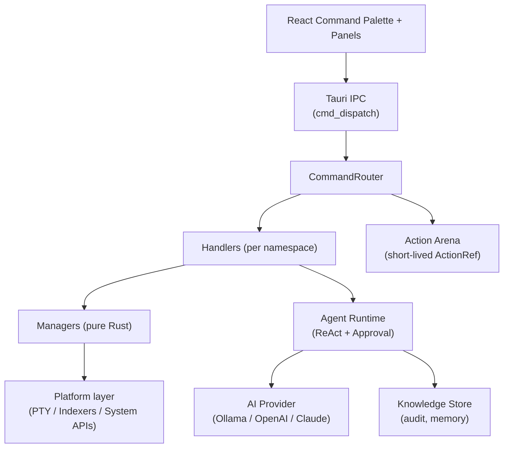

<div align="center">

# Keynova

**A keyboard-first productivity launcher for developers.**

[](LICENSE)
[](https://tauri.app)
[](https://www.rust-lang.org/)
[](https://react.dev/)
[](#platform-support)

Local-first command palette, search, terminal, notes, and an approval-gated AI Agent — built with Tauri 2, React 18, and Rust.

</div>

---

## Overview

Keynova lets you complete 90%+ of developer workflows without a mouse. One keystroke opens the palette; from there you launch apps and files, search the workspace, run a terminal, take notes, translate, calculate, and orchestrate an AI agent — all by typing.

Three design principles run through the codebase:

- **Local-first.** AI Chat and Agent run on the provider/model you select in settings. The default is local Ollama; OpenAI and Claude are opt-in configuration, never required.
- **Approval-gated execution.** Every destructive or external action passes through a typed approval boundary. There is no generic shell tool.
- **Bounded everything.** Search, indexing, prompts, observations, and tool output are all size- and time-bounded; resources are released when the surface closes.

## Features

| Area | Capabilities |
|---|---|
| **Command Palette** | Fuzzy launcher across apps, files, notes, history, models, settings, and built-in commands |
| **Layered Search** | Windows Everything IPC → cross-platform Tantivy index → bounded file/app cache fallback; streaming results with cancellation |
| **Local-first AI** | Ollama by default with auto-recommended model based on detected RAM; OpenAI / Claude optional |
| **Agent Runtime** | Provider-driven ReAct loop, typed tool registry with JSON Schema, prompt audit, observation redaction, approval gates |
| **Terminal Panel** | Portable PTY (xterm.js + portable-pty); lazy-init; optional LazyVim launch via `/note lazyvim` |
| **Notes** | Markdown-first storage, workspace-bound, with translation and AI assist |
| **Workflow Pipeline** | `cmd a \| ai b` chains commands sequentially with per-stage status |
| **Utilities** | Calculator, translation, history, hotkeys, mouse/system controls, model management |
| **Lazy Runtime** | Heavy services (PTY, file indexer, AI keep-alive, system monitoring) cold-start on demand |

See [`docs/architecture.md`](docs/architecture.md) for the module map.

## Quick Start

### Prerequisites

- **Node.js** 18 or newer
- **Rust** stable (1.75+)
- Platform toolchain:
  - **Windows**: MSVC build tools, WebView2 runtime
  - **Linux**: `webkit2gtk-4.1`, `libssl-dev`, `gtk-3-dev`
  - **macOS**: Xcode command-line tools

### Run from source

```bash
npm install
npm run tauri dev      # dev mode with hot reload
```

### Build a release bundle

```bash
npm run tauri build    # produces installers under src-tauri/target/release/bundle/
```

## Local-first AI Setup

Keynova defaults to local Ollama with `ai.provider = "ollama"` and a model selected based on detected RAM (`qwen2.5:7b` on 16 GB+, smaller models on lower RAM). On first `/ai` launch a setup card guides you:

1. Install [Ollama](https://ollama.com).
2. Pull the recommended model: `ollama pull qwen2.5:7b` (or the suggestion shown).
3. Or switch provider in `/setting → ai.provider` to `claude` / `openai` and supply an API key.

The setup card vanishes once Ollama is reachable and the configured model is available. **Use anyway** dismisses it without completing setup.

## AI Modes

| Mode | When to use | Safety |
|---|---|---|
| **Chat** | Conversational Q&A through the selected provider/model | Single-turn, no tools, no side effects |
| **Agent** | Multi-step planning with tools (search, file preview, git status, ...) | Typed tool registry, observation redaction, explicit approval for medium/high-risk actions |

Both modes share the same provider/model. Providers without function calling fall back to local heuristic planning. There is no generic shell tool in the default registry; generic shell execution is gated behind per-platform sandbox work (see [ADR-0027](docs/adr/0027-generic-shell-sandbox.md)).

## Configuration

Runtime config lives at the platform config directory:

| OS | Path |
|---|---|
| Windows | `%APPDATA%\Keynova\config.toml` |
| Linux | `~/.config/keynova/config.toml` |
| macOS | `~/Library/Application Support/Keynova/config.toml` |

Common keys:

```toml
[ai]
provider = "ollama"          # ollama | openai | claude
model = "qwen2.5:7b"
ollama_url = "http://localhost:11434"
ollama_timeout_secs = 120
ollama_keep_alive = "5m"     # "0s" disables keep-alive
max_tokens = 4096
timeout_secs = 30

[performance]
low_memory_mode = false      # disables prewarm and startup indexing

[agent]
mode = "auto"                # auto | offline
web_search_provider = "disabled"  # searxng | tavily | duckduckgo
web_search_timeout_secs = 8
long_term_memory_opt_in = false

[agent.local_context]
enabled = false              # gates FEAT.11 local filesystem review (see ADR-0028)
max_scan_files = 500
max_preview_bytes = 4096
max_depth = 4

[search]
backend = "auto"             # auto | tantivy | everything | system
index_dir = ""               # empty → platform-default

[security]
network_allowlist = ""       # comma-separated host allowlist for outbound requests
```

Settings are also editable in-app via `/setting`.

## Architecture



Key entry points:

- **Composition root** — `src-tauri/src/app/state.rs` (`ManagerBundle`, `CommandRouter`)
- **IPC contract** — typed DTOs in `src-tauri/src/models/ipc_requests.rs`, route constants in `src/ipc/routes.ts`
- **Agent runtime** — `src-tauri/src/core/agent_runtime.rs` (ReAct loop, tool registry, Condvar-based approval/cancel)
- **Search service** — `src-tauri/src/managers/search_service.rs` (single-worker actor with cancel-token propagation)
- **Settings schema** — `src-tauri/src/models/settings_schema.rs`

Full architecture map: [`docs/architecture.md`](docs/architecture.md).

## Platform Support

| OS | Version | Status |
|---|---|---|
| Windows | 10 or newer | Primary development target; Everything IPC supported |
| Linux | X11 / Wayland | Supported; uses Tantivy as primary index, `wmctrl`/`locate` fallbacks where available |
| macOS | 11 or newer | Supported; native indexer integration (Spotlight `mdfind`) is on the roadmap |

## Documentation

| Document | Purpose |
|---|---|
| [`docs/index.md`](docs/index.md) | Documentation router |
| [`docs/project.md`](docs/project.md) | Stable project facts |
| [`docs/architecture.md`](docs/architecture.md) | Module-level architecture |
| [`docs/security.md`](docs/security.md) | Security boundaries and approval policy |
| [`docs/testing.md`](docs/testing.md) | Test strategy, memory measurement checklist |
| [`docs/decisions.md`](docs/decisions.md) | ADR index (0001–0028, future ADR-029+ reserved) |
| [`docs/tasks/active.md`](docs/tasks/active.md) | Current execution state |
| [`docs/tasks/backlog.md`](docs/tasks/backlog.md) | Proposed work |
| [`docs/tasks/completed.md`](docs/tasks/completed.md) | Delivered work history |
| [`docs/tasks/blocked.md`](docs/tasks/blocked.md) | Blocked / ADR-pending tracks |
| [`docs/CLAUDE.md`](docs/CLAUDE.md) | AI agent governance and ADR rules |

## Development

### Common commands

```bash
npm run tauri dev          # dev mode with hot reload
npm run tauri build        # production bundle
npm run lint               # eslint
npm run build              # frontend type-check + bundle
cargo test                 # backend tests (~230, run from src-tauri/)
cargo clippy -- -D warnings
npm run docs:refresh       # docs sync + drift guard
```

### Git workflow

```
main  <- always releasable
  <- dev (integration)
      <- feature/<name> (work branches)
```

Feature branches start from `dev`. Do not merge without explicit review.

### Documentation discipline

Keynova uses retrieval-first documentation: AI agents and contributors should consult [`docs/index.md`](docs/index.md), [`docs/memory/current.md`](docs/memory/current.md), and [`docs/tasks/active.md`](docs/tasks/active.md) before working. After any meaningful change, `npm run docs:refresh` syncs the index and runs `docs:guard` to block drift.

A task group reaching 100% complete must be moved from `backlog.md` to `completed.md` in the same change-set — see [`docs/CLAUDE.md` §5a](docs/CLAUDE.md).

## Roadmap

Current focus areas (full breakdown in [`docs/tasks/backlog.md`](docs/tasks/backlog.md)):

- **Phase 7** — Agent surface upgrades: token streaming, markdown rendering, cancel-during-running, friendly error cards, approval UX
- **Phase 7** — Agent tool surface rebalance: shift from "research helper" tools to action-oriented integration with notes, translation, hotkey, terminal proposal
- **Phase 8** — Productivity baseline: search secondary-actions menu, in-launcher dev utilities (`uuid`, `hash`, `regex`, `jwt`, …), first-run onboarding tour
- **Phase 9** — Context awareness: OS-level selection capture, focused-app hint, last-terminal-error context, macros & quick actions
- **Phase 10** — OS-integrated surfaces: clipboard history, snippet expansion, window switcher
- **Phase 11+** — Reminders / scheduler, notes evolution, settings sync, dev specials, inline AI surfaces

Each phase that touches a security boundary or data contract is gated by an ADR under [`docs/adr/`](docs/adr/).

## Contributing

Contributions are welcome under the MIT license. Before submitting a PR:

1. Run `cargo test`, `cargo clippy -- -D warnings`, `npm run lint`, `npm run docs:refresh`.
2. Update the relevant `docs/tasks/*.md` and `docs/memory/current.md` per [`docs/CLAUDE.md`](docs/CLAUDE.md).
3. If the change touches security, IPC contracts, or architecture, add or update an ADR.

## License

[MIT](LICENSE) © Keynova contributors.