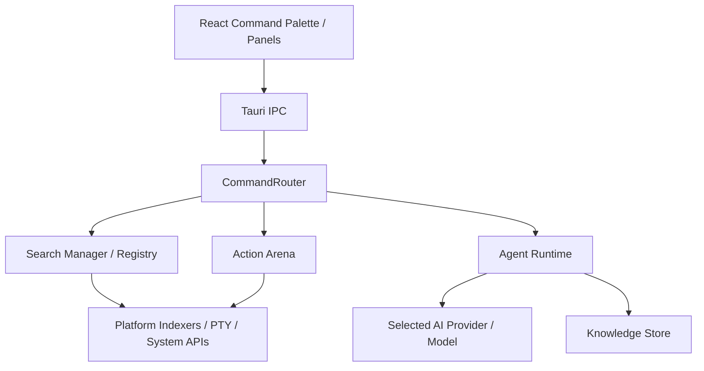

# Keynova

Keynova is a keyboard-first desktop productivity launcher for developers, built with Tauri 2, React, and Rust. It combines command launching, local search, terminal panels, notes, history, model management, and an approval-gated AI Agent runtime.

The project is local-first by design. AI Chat and Agent mode use the AI provider/model selected in settings, including local Ollama models. OpenAI-compatible or Claude API providers are optional configuration choices, not mandatory Agent backends.

## Current Capabilities

- Command palette with app, file, command, note, history, model, and setting results.
- Action Arena for backend-held actions, short-lived `ActionRef` values, secondary actions, and approval boundaries.
- Progressive search with quick first results, streamed chunks, lazy metadata previews, lazy icon loading, recent/frequent ranking, and workspace-weighted history.
- File search through Windows Everything IPC when available, persisted Tantivy index fallback, and app/file cache fallback.
- `/ai` panel with normal chat and guarded Agent mode.
- Notes, calculator, translation, history, workspace binding, terminal panel, hotkeys, mouse/system controls, and model management.
- `/note lazyvim` support for opening notes in a project-contained LazyVim terminal session.

## Local-First AI Setup

Keynova defaults to local AI: `ai.provider = "ollama"` with `model = "qwen2.5:7b"`. On first `/ai` launch, a setup card guides through three steps:

1. Install [Ollama](https://ollama.com) if not present.
2. Pull the recommended model: `ollama pull qwen2.5:7b` (model is chosen based on detected RAM).
3. Or switch provider to Claude or OpenAI in `/setting → ai.provider`.

The setup card disappears once Keynova can reach Ollama and find the configured model. A "Use anyway" button dismisses it without completing setup.

Cloud provider options (Claude, OpenAI) require an API key in settings and work without Ollama installed.

## AI And Agent Runtime

Keynova has two AI surfaces:

- Chat mode: normal conversational AI through the selected `ai.provider` and model.
- Agent mode: guarded local planning and tool use, with context filtering, grounding sources, audit logging, and approval gates.

Agent mode must use the same selected provider/model as AI Chat. If `ai.provider = "ollama"`, Agent work targets the configured local Ollama model and does not require an API key. If `ai.provider = "openai"` or `claude`, the matching configured API provider is used.

The current Agent safety foundation includes:

- Typed tool specifications with generated JSON Schemas from Rust structs.
- Observation redaction and truncation before tool output enters model context.
- Low-risk read-only tools such as Keynova search, filesystem search metadata, file previews, and web search.
- Approval-gated action proposals for higher-risk work.
- No generic shell tool in the default Agent tool registry. Generic shell execution is guarded by a per-platform sandbox (Windows Job Objects, Linux bwrap, macOS sandbox-exec) that must be fully evaluated before the tool is enabled.

The provider-driven ReAct loop is implemented; OpenAI-compatible and Ollama providers support tool calls. Claude and providers that do not support function calling fall back to local heuristics.

## Search

Keynova search is layered:

- Windows: Everything IPC is preferred when available.
- Cross-platform persisted index: Tantivy stores file/folder metadata on disk.
- Fallback: existing app/file cache and bounded local search paths.

Agent filesystem search is being moved toward a `SystemIndexer` abstraction so OS-native indexers such as Everything, Spotlight `mdfind`, and Linux `plocate`/`locate` can be used first, with bounded fallback traversal only when the native index is missing or stale.

## Configuration

Runtime config lives in the platform config directory, for example:

- Windows: `%APPDATA%\Keynova\config.toml`
- Linux/macOS: `~/.config/keynova/config.toml`

Important AI settings:

```toml
[ai]
provider = "ollama" # claude | ollama | openai
model = "qwen2.5:7b"
ollama_url = "http://localhost:11434"
ollama_timeout_secs = 120
api_key = "" # Claude key, only needed when provider = "claude"
openai_api_key = "" # only needed when provider = "openai"
openai_base_url = "https://api.openai.com/v1"
openai_model = "gpt-4o-mini"
max_tokens = 4096
timeout_secs = 30

[agent]
web_search_provider = "disabled" # disabled | searxng | tavily | duckduckgo
searxng_url = ""
web_search_api_key = "" # Tavily key when provider = "tavily"
web_search_timeout_secs = 8
long_term_memory_opt_in = false
```

For local-first Agent use, install Ollama, pull a model, and set `ai.provider = "ollama"` plus `ai.model` to the model name.

## Development

Install dependencies:

```bash
npm install
```

Run the app in development:

```bash
npm run tauri dev
```

Build production artifacts:

```bash
npm run tauri build
```

Useful verification commands:

```bash
npm run lint
npm run build
cargo test
cargo clippy -- -D warnings
git diff --check
```

Run Rust commands from `src-tauri/`.

## Architecture



## Roadmap

- Harden the provider-driven ReAct Agent loop.
- Add `SystemIndexer` implementations for OS-native file search.
- Replace fragile web-search HTML parsing with structured search adapters where configured.
- Expand regression coverage for Agent cancellation, approval, observation redaction, provider timeout, and search fallback behavior.
- Continue Phase 5 plugin/WASM runtime work.

## License

MIT License.
