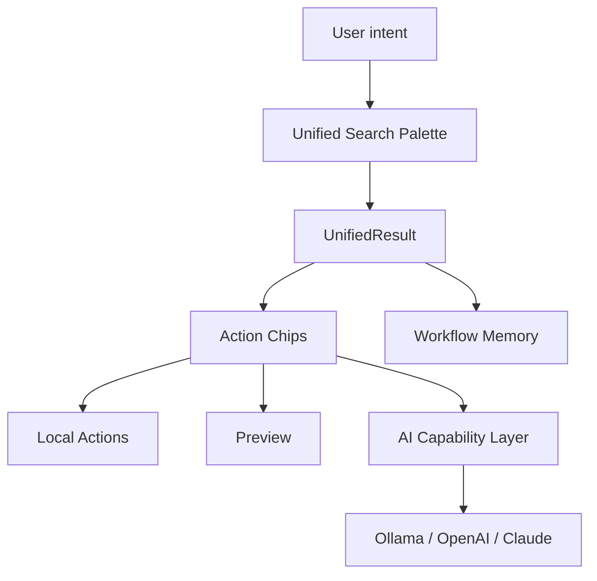

<div align="center">

# Keynova

**鍵盤優先的本機工作流入口，為技術工作者減少 context switching。**

[](LICENSE)
[](https://tauri.app)
[](https://www.rust-lang.org/)
[](https://react.dev/)
[](#平台支援)
[](https://github.com/aionyx02/keynova/releases)

Keynova 不是另一個 AI Chat 工具。它是一個 unified workflow entry：搜尋、啟動、檔案操作、終端機、筆記、工具命令與 AI capability 都從同一個入口出發。

</div>

---

## 產品定位

Keynova 的核心目標很直接：讓你少切視窗、少摸滑鼠、少在工具之間來回搬運上下文。

傳統 launcher 只負責「打開東西」。Keynova 想做的是更完整的工作流入口：你輸入一次，系統同時理解應用程式、檔案、工作區、歷史操作、內建工具與可執行 action。AI 不是主角，而是需要時出現在結果列旁邊的 capability。

目前最高優先級是 P0 架構重構：把舊的 chat-first agent 降級為 stateless inline capability，並把 unified search / unified result schema 變成產品主軸。未完成項目在本 README 皆標為「實現中」。

## v0.4.0 重點

- 移除舊版 chat-first AI 介面（`AiPanel`）：`ai_legacy_chat` 命令與 chat 面板已實體刪除，AI 互動完全收斂到 search-first capability flow。後端 agent runtime（typed-tool + approval 框架）保留為休眠資產，`ai.legacy_agent` 改為無 UI 入口的保留旗標，日後若 capability 需要 tool-using 可重新接上。
- Linux / macOS release 修復：先前 `v0.3.0` 的 Linux（apt 套件衝突）與 macOS universal（二進位命名）build 失敗、等於只出了 Windows；本版修好跨平台 CI，三平台 artifact 一起出貨。
- AI 互動正式變成 search-first capability flow：`explain`、`summarize`、`fix`、`cmd`、`next` 都能直接從 palette 進入，不需要把舊 chat-first 流程放回 hot path。
- 自然語言入口更低摩擦：空白 palette 會直接顯示 `next` 建議；查無結果的操作意圖查詢會自動升級成 AI command generation。
- Workflow memory 現在能對近期命令型操作做 replay / follow-up ranking，不再只是一個被動紀錄。
- Windows idle-memory pass 已落地：最新 debug re-check 顯示冷隱藏約 `63.7 MB` working set / `124.7 MB` private memory，`keynova start` 喚醒約 `10-13 ms`，暖喚醒後約 `93-106 MB` working set；production 主入口 eager chunk 約 `104.28 kB`。
- 先前「release working set 偏高」已釐清：Keynova 真實的常駐足跡（獨占 RAM）只有 `~80 MB`（host `~8 MB` + WebView2 子行程 `~71 MB`），遠低於 `200 MB` 目標。工作管理員顯示的 `~324 MB` 是整棵行程樹的工作集，其中 `~243 MB` 是 Edge/Chromium runtime 的共享 DLL 頁——OS 只存一份、跨應用共用、卻被每個子行程各算一次，並非 Keynova 多吃的記憶體。
- `npm run tauri dev` 會重用既有的 Keynova dev server，並在啟動前清掉卡住的 debug app，避免 `1420` port collision 和 Windows file-lock 問題。

## 記憶體用量（Windows）

2026-05-31 release（`cargo build --release`，已含 `[profile.release]` strip+LTO）實測，Keynova 的**真實常駐足跡（獨占 RAM，Private Working Set）**：

- **Host `tauri-app.exe`**：`~8 MB`
- **Keynova 擁有的 7 個 WebView2 子行程**：`~71 MB`（renderer / Blink / V8 / network 等必要底盤）
- **合計 `~80 MB`** — 遠低於 `200 MB` 背景核心目標

> 注意：工作管理員 / 資源監視器會把整棵行程樹顯示成 `~324 MB` 工作集。那是含 Edge/Chromium 共享 runtime 頁的數字——OS 只存一份、跨所有 WebView2 應用共用、卻被每個子行程的工作集各算一次，並非 Keynova 多吃的記憶體。隔離方式：以「啟動前後 `msedgewebview2` PID 差集」取出 Keynova 自己擁有的子行程，量其 Private Working Set。

管理手段：`[profile.release]`（strip + thin-LTO，binary 25.1 → 22.5 MB）、隱藏時 host `EmptyWorkingSet` + WebView2 `SetMemoryUsageTargetLevel(Low)`、`--disable-gpu`。

## 下載與安裝（Beta）

Keynova 目前處於底層架構重構與快速迭代階段，但已開始提供預先編譯的安裝檔，方便不想配置 Node.js / Rust 環境的使用者直接試用。

最新版本與所有 artifact 都在 [GitHub Releases](https://github.com/aionyx02/keynova/releases)：

| 平台    | 檔案                                                      | 安裝方式                                                           |
| ------- | --------------------------------------------------------- | ------------------------------------------------------------------ |
| Windows | `Keynova_<version>_x64-setup.exe` (NSIS) 或 `_x64.msi`    | 雙擊執行 → 一鍵安裝；卸載走「設定 → 應用程式」                     |
| macOS   | `Keynova_<version>_universal.dmg`                         | 開啟 `.dmg` → 拖入「應用程式」資料夾                               |
| Linux   | `keynova_<version>_amd64.deb` / `keynova_<version>_amd64.AppImage` | `sudo apt install ./*.deb` 或直接賦予 `.AppImage` 執行權限後執行 |

第一次執行的注意事項：

- **Windows** SmartScreen 會出現「無法辨識」警告：點「其他資訊 → 仍要執行」即可。Build 尚未做 code signing。
- **macOS** Gatekeeper 會擋未簽章 app：在「系統設定 → 隱私權與安全性」按一次「允許」，或執行 `xattr -d com.apple.quarantine /Applications/Keynova.app`。
- **Linux** AppImage 需先 `chmod +x` 才能執行；deb 安裝後預設加進 PATH。

自動更新（Auto-updater）仍在計畫中，目前更新需手動下載新版安裝。

## Keynova 解決的問題

| 問題                                               | Keynova 的方向                                                 | 狀態           |
| -------------------------------------------------- | -------------------------------------------------------------- | -------------- |
| 工作時一直切換 IDE、檔案總管、終端機、瀏覽器與筆記 | 用單一 command palette 聚合搜尋、啟動與 action                 | 已可用         |
| 搜尋結果來源太分散，前端需要適配多種 result shape  | 統一成 `UnifiedResult`，所有來源共用 result/action schema      | 已可用         |
| AI Chat 迫使使用者離開當前 workflow                | AI 改為 inline capability，支援 prefix 與自然語言 fallback（如 `explain <text>`、`fix <error>`、`cmd`、`next`） | 已可用         |
| autonomous agent 行為不可預測，安全邊界難掌控      | AI capability 改成單步、stateless、typed input/output          | 實現中         |
| destructive action 容易誤觸                        | action 使用風險標記與 UI confirmation gate                     | 已可用，實現中 |
| 使用越久沒有變快                                   | workflow memory 記錄近期操作，提供可預測的 recent/suggestion 與 replay | 已可用，實現中 |
| 本機隱私與外部服務邊界不清楚                       | local-first，外部 provider 與網路能力需明確 opt-in             | 已可用，實現中 |

## 目前能力狀態

| 模組                       | 能力                                                 | 狀態           |
| -------------------------- | ---------------------------------------------------- | -------------- |
| Command Palette            | 鍵盤開啟、模糊搜尋、結果瀏覽、快捷操作               | 已可用         |
| Workspace Search           | 工作區感知搜尋、檔案與 app 結果、串流回傳            | 已可用         |
| File Actions               | 開啟、顯示於檔案總管、預覽、重新命名、移動、刪除驗證 | 已可用         |
| Secondary Action Menu      | 結果列上的二級操作與 confirmation flow               | 已可用         |
| Preview Pane               | 文字、圖片與檔案 metadata 預覽                       | 已可用         |
| Terminal Panel             | 內嵌終端機與 lazy runtime                            | 已可用         |
| Notes                      | Markdown 筆記與工作區脈絡                            | 已可用         |
| Calculator / Dev Utilities | 常用計算、轉換與開發者小工具                         | 已可用         |
| Onboarding                 | 首次使用引導、空狀態 CTA、cheatsheet                 | 已可用         |
| Legacy AI Chat (AiPanel)   | chat-first 介面已於 REF.8 移除（`ai_legacy_chat` 命令 + `AiPanel` 刪除） | 已移除 |
| AI Capability Layer        | `explain` / `summarize` / `fix_error` / `gen_command` / `suggest_next` 五個 capability 已上線 | 已可用         |
| Inline Capability & NL Flow | prefix (`explain` / `summarize` / `fix`) + 空白 `next` + 查無結果自然語言 fallback | 已可用         |
| Unified Result Schema      | 統一 result、preview、rank signal、action chip       | 已可用         |
| Workflow Memory            | recent workflow、context hash、suggestion ranking、replay descriptor | 已可用         |
| Model Manager 整合         | 下載、列表、移除模型整合成單一管理面板               | 實現中         |
| Agent 後端（休眠）         | typed-tool + approval 框架保留為休眠資產，無 UI 入口，`ai.legacy_agent` 為保留旗標 | 保留（休眠）   |

## 使用方式

### 1. 開啟 Keynova

預設使用全域快捷鍵開啟 launcher。開發階段常用的是 `Ctrl+K`；若你的環境有快捷鍵衝突，可在設定面板調整。

打開後直接輸入你想做的事：

```text
settings
terminal
README
src-tauri
hash
git status
```

### 2. 搜尋與啟動

你可以把 Keynova 當成統一搜尋入口：

- 搜尋 app、檔案、工作區內容與內建命令。
- 用方向鍵選擇結果。
- 按 Enter 執行主要 action。
- 在支援的結果上打開 secondary action menu，選擇 open、reveal、preview、rename、move、delete 等操作。

### 3. 檔案操作

檔案結果可直接執行常用操作。對 destructive action，Keynova 會走 confirmation flow；刪除類操作會驗證檔案是否真的離開原路徑，避免「UI 顯示刪了，但磁碟還在」的假成功。

### 4. 終端機與開發工具

Keynova 內建終端機面板與常用 dev utilities，適合快速完成短任務：

```text
killport 3000
uuid
hash
regex
jwt
```

實際可用命令以 launcher 內的結果與提示為準。

### 5. AI 使用方式

舊版 chat-first AI Chat 介面已移除，AI 完全走 inline capability：

- 已可用：在 launcher 直接輸入 prefix keyword 觸發 inline capability，例如：

  ```text
  explain <貼上一段程式碼或錯誤訊息>
  summarize <貼上一段長文>
  fix <錯誤訊息>
  ```

  capability 是單步、stateless，呼叫後串流回答到 result area，可一鍵 Copy 為 Markdown 或存到筆記。
- 已可用：空白 palette 會直接顯示 `next` 建議；查無結果的自然語言意圖會自動判斷成 `explain` / `summarize` / `fix` / `cmd`。
- 已可用：`cmd` 會生成可複製、可編輯、可送進附加終端機的命令卡；`next` 會顯示近期工作流建議並支援 replay。
- 已可用：每次 AI 呼叫都是單步 capability，不保留 session memory，不自主連續執行工具。
- chat-first 介面已移除：`AiPanel` 與 `ai_legacy_chat` 命令已在 REF.8 刪除。`ai.legacy_agent` 現為保留的後端旗標（無 UI 入口）；後端 agent runtime 保留為休眠資產，供日後 tool-using capability 重新接用。
- 已可用：刪除 / 重新命名 / 移動等 destructive file action 已走 UI confirmation gate；更泛化的 data-driven action confirm 仍在後續 capability action 收尾。

這代表 Keynova 不會試圖取代 ChatGPT 或 Claude 的長對話場景。它會把 AI 放在你正在工作的地方，幫你解釋錯誤、摘要內容、產生命令或補上下一步建議。

## 從原始碼啟動

想跟著 main 分支開發或自行修改 Keynova，請依下列步驟。直接使用安裝檔的使用者可跳過本節，回到上方[下載與安裝](#下載與安裝beta)。

### 環境需求

- Node.js 18+
- Rust stable
- Windows：MSVC Build Tools、WebView2 Runtime
- Linux：Tauri 2 所需 GTK/WebKit 相關套件
- macOS：Xcode Command Line Tools

### Dev 模式

```bash
npm install
npm run tauri dev
```

`npm run tauri dev` 目前會先重用既有的 `1420` Keynova Vite server，並在 Windows 上主動關閉卡住的 debug `tauri-app.exe`，降低反覆開發時的啟動失敗率。

### 自行建置 release bundle

```bash
npm run tauri build
```

產物會輸出到 `src-tauri/target/release/bundle/`，包含對應平台的 NSIS / MSI / DMG / DEB / AppImage。CI 上的等價流程定義在 `.github/workflows/release.yml`，push 一個 `v*` tag 即可觸發跨平台 build 與 draft release。

## 常用開發指令

```bash
npm run dev              # Vite frontend dev server
npm run tauri dev        # Tauri app dev mode
npm run build            # TypeScript check + frontend build
npm run lint             # ESLint
npm run rust:test        # Rust tests
npm run rust:clippy      # Rust clippy with -D warnings
npm run docs:refresh     # docs sync + guard checks
npm run verify           # docs + frontend + Rust verification
```

## 設定

設定檔位於平台 config 目錄：

| 平台    | 路徑                                                |
| ------- | --------------------------------------------------- |
| Windows | `%APPDATA%\Keynova\config.toml`                     |
| Linux   | `~/.config/keynova/config.toml`                     |
| macOS   | `~/Library/Application Support/Keynova/config.toml` |

常見設定範例：

```toml
[ai]
provider = "ollama"
model = "qwen2.5:7b"
ollama_url = "http://localhost:11434"
legacy_agent = false

[performance]
low_memory_mode = false

[search]
backend = "auto"

[security]
network_allowlist = ""
```

`legacy_agent` 預設為 `false`，且 chat-first UI 已在 REF.8 移除，此旗標現為無 UI 入口的保留後端 gate；後端 agent runtime 保留為休眠資產，日後 tool-using capability 可重新接用。

`performance.low_memory_mode = true` 會跳過 terminal prewarm、延後 startup indexing，並把預設 Ollama keep-alive 從 `5m` 縮到 `0s`。如果你在 Windows 上比較在意常駐記憶體，這是目前最直接的降載開關。

## 架構方向


```mermaid
graph TD
    User["User intent"] --> Palette["Unified Search Palette"]
    Palette --> Result["UnifiedResult"]
    Result --> Action["Action Chips"]
    Action --> Local["Local Actions"]
    Action --> Preview["Preview"]
    Action --> Capability["AI Capability Layer"]
    Capability --> Provider["Ollama / OpenAI / Claude"]
    Result --> Memory["Workflow Memory"]
```

目標架構的幾個原則：

- Search-first：搜尋框是 dispatcher，不是聊天視窗入口。
- Local-first：預設偏向本機能力，外部服務明確 opt-in。
- Typed boundary：IPC、action、AI capability 都使用 typed contract。
- Approval-aware：高風險操作必須可見、可確認、可取消。
- Bounded runtime：搜尋、預覽、prompt、工具輸出與背景服務都要有大小和時間上限。

## 重構路線

目前 P0 任務在 [docs/tasks/refactor-ai-capability.md](docs/tasks/refactor-ai-capability.md)：

| 批次    | 目標                                           | 狀態                                  |
| ------- | ---------------------------------------------- | ------------------------------------- |
| `REF.0` | ADR-0029 決策鎖定                              | 已完成                                |
| `REF.1` | Unified Result Schema                          | 已完成                                |
| `REF.2` | Command Palette 拆分                           | 已完成（landed 598 行）               |
| `REF.3` | Agent handler module split                     | 已完成                                |
| `REF.4` | Stateless AI Capability Layer                  | 已完成（5/5 capabilities live）       |
| `REF.5` | Workflow Memory                                | 已完成                                |
| `REF.6` | Search box as pure dispatcher                  | 大致完成（`cmd` / `next` / NL fallback 已落地，仍有收尾） |
| `REF.7` | Quantitative gates + legacy default off        | 進行中（A/B done、release WS 已收斂為真實 ~80 MB；僅剩 qwen2.5:7b 正式 benchmark 待補） |
| `REF.8` | Physical removal of deprecated chat/agent code | 部分完成（`AiPanel` / chat UI 已刪；agent 後端保留休眠） |

量化目標：

- `CommandPalette.tsx`：原訂 250 行以下，REF.2 landed 在 598 行後決定接受現狀，`< 250 / < 400` 重新留給 REF.6 收尾。
- `handlers/agent/mod.rs`：2406 行先降到 600 行以下（REF.3 landed 616），觀察期後刪除或壓到 100 行以下。
- `agent_runtime.rs`：原本 docx 的 `< 400` 門檻已移除；repo 現況改以 `REF.8` 的舊路徑清理為準。
- `AiPanel.tsx`：已於 REF.8 移除（979 行）；後端 agent runtime 保留為休眠資產。
- Palette cold open：200 ms 以下。
- Search first chunk P50：80 ms 以下。
- AI inline P50：800 ms 以下（REF.7 仍需補正式 qwen2.5:7b 量測）。

## 平台支援

| 平台                | 狀態         | 備註                                 |
| ------------------- | ------------ | ------------------------------------ |
| Windows 10+         | 主要開發平台 | 支援 Everything / WebView2 工作流    |
| Linux X11 / Wayland | 實現中       | 使用跨平台搜尋與系統 fallback        |
| macOS 11+           | 實現中       | 部分 OS integration 會依權限逐步補齊 |

## 文件導覽

| 文件                                                                         | 用途                       |
| ---------------------------------------------------------------------------- | -------------------------- |
| [docs/index.md](docs/index.md)                                               | 文件路由入口               |
| [docs/memory/current.md](docs/memory/current.md)                             | 當前策略與限制             |
| [docs/tasks/active.md](docs/tasks/active.md)                                 | 目前 active queue          |
| [docs/tasks/refactor-ai-capability.md](docs/tasks/refactor-ai-capability.md) | P0 重構批次任務            |
| [docs/tasks/blocked.md](docs/tasks/blocked.md)                               | 安全限制與 ADR gate        |
| [docs/architecture.md](docs/architecture.md)                                 | 架構參考                   |
| [docs/security.md](docs/security.md)                                         | 安全與 permission boundary |
| [docs/decisions.md](docs/decisions.md)                                       | ADR 索引                   |

## 貢獻與開發原則

Keynova 目前仍在快速演進，PR 應該優先服務 P0 refactor，而不是增加新功能。

送出變更前請確認：

```bash
npm run verify
```

開發原則：

- 不新增 generic shell execution。
- 不把 AI 放回產品核心。
- 不繞過 approval / confirmation boundary。
- 不讓單一 component 或 handler 再次變成 god module。
- 重要架構、安全、IPC contract 變更必須先走 ADR。

## License

[MIT](LICENSE)
