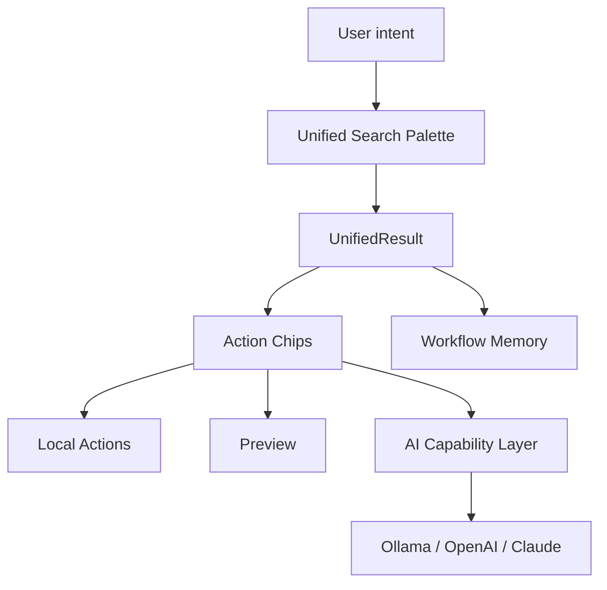

<div align="center">

# Keynova

**鍵盤優先的本機工作流入口，為技術工作者減少 context switching。**

[](LICENSE)
[](https://tauri.app)
[](https://www.rust-lang.org/)
[](https://react.dev/)
[](#平台支援)
[](https://github.com/aionyx02/keynova/releases)

一次輸入，同時搜尋應用程式、檔案、工作區、內建工具與可執行 action。AI 不是主角，而是需要時就在你手邊出現的 capability。

</div>

---

## Keynova 是什麼

Keynova 是一個 unified workflow entry：把搜尋、啟動、檔案操作、終端機、筆記、開發小工具與 AI capability 收斂到同一個鍵盤入口。目標很直接——讓你少切視窗、少摸滑鼠、少在工具之間來回搬運上下文。

傳統 launcher 只負責「打開東西」。Keynova 想做的是更完整的工作流入口：你輸入一次，系統同時理解應用程式、檔案、工作區、歷史操作、內建工具與可執行 action，並在需要時把 AI 以單步、可預測的 capability 形式接上來。

它不會試圖取代 ChatGPT / Claude 的長對話場景，而是把 AI 放在你正在工作的地方：解釋錯誤、摘要內容、產生命令、補上下一步建議。

## 主要功能

| 模組 | 能力 |
| --- | --- |
| Command Palette | 全域快捷鍵開啟、模糊搜尋、結果瀏覽、鍵盤操作 |
| Workspace Search | 工作區感知搜尋、app 與檔案結果、串流回傳 |
| File Actions | 開啟、在檔案總管顯示、預覽、重新命名、移動、刪除（含真實刪除驗證）|
| Secondary Action Menu | 結果列上的二級操作與 confirmation flow |
| Preview Pane | 文字、圖片與檔案 metadata 預覽 |
| Terminal | 內嵌終端機面板、lazy runtime、附加 launch spec |
| Notes | Markdown 筆記與工作區脈絡 |
| Calculator / Dev Utilities | 計算、轉換與開發者小工具（hash / uuid / regex / jwt / killport 等）|
| Translation | 文字翻譯，採用 Google Cloud Translation v2 |
| Model Manager | 單一分頁式 `/model` 面板：下載、列出、移除本機模型 |
| AI Capability Layer | `explain` / `summarize` / `fix_error` / `gen_command` / `suggest_next` 五個單步 capability |
| Inline / NL Flow | prefix（`explain` / `summarize` / `fix` / `cmd`）+ 空白 `next` + 查無結果時的自然語言 fallback |
| Unified Result | 所有來源共用 result / preview / rank signal / action chip schema |
| Workflow Memory | 記錄近期操作、context hash、suggestion ranking、可重播的 replay descriptor |
| Onboarding | 首次使用引導、空狀態 CTA、cheatsheet |

## 下載與安裝

預先編譯的安裝檔都在 [GitHub Releases](https://github.com/aionyx02/keynova/releases)，方便不想配置 Node.js / Rust 環境的使用者直接試用。

| 平台 | 檔案 | 安裝方式 |
| --- | --- | --- |
| Windows | `Keynova_<version>_x64-setup.exe`（NSIS）或 `_x64.msi` | 雙擊執行 → 一鍵安裝；卸載走「設定 → 應用程式」 |
| macOS | `Keynova_<version>_universal.dmg` | 開啟 `.dmg` → 拖入「應用程式」資料夾 |
| Linux | `keynova_<version>_amd64.deb` / `keynova_<version>_amd64.AppImage` | `sudo apt install ./*.deb`，或賦予 `.AppImage` 執行權限後執行 |

### 第一次執行

目前 release **尚未做 code signing / 公證**，所以：

- **Windows**：SmartScreen 會出現「無法辨識」警告 → 點「其他資訊 → 仍要執行」。
- **macOS**：Gatekeeper 會擋未簽章 app → 在「系統設定 → 隱私權與安全性」按一次「允許」，或執行 `xattr -d com.apple.quarantine /Applications/Keynova.app`。
- **Linux**：AppImage 需先 `chmod +x`；deb 安裝後預設加進 PATH。

自動更新（auto-updater）仍在計畫中，目前更新需手動下載新版安裝。

## 使用方式

### 開啟與搜尋

預設用全域快捷鍵 `Ctrl+K` 開啟 launcher（可在設定面板調整）。打開後直接輸入你想做的事：

```text
settings
terminal
README
git status
hash
```

- 搜尋 app、檔案、工作區內容與內建命令。
- 方向鍵選擇、Enter 執行主要 action。
- 在支援的結果上打開 secondary action menu：open、reveal、preview、rename、move、delete。

### 檔案操作

對 destructive action，Keynova 會走 confirmation flow；刪除類操作會驗證檔案是否真的離開原路徑，避免「UI 顯示刪了、磁碟還在」的假成功。

### 終端機與開發工具

```text
killport 3000
uuid
hash
regex
jwt
```

實際可用命令以 launcher 內的結果與提示為準。

### AI（inline capability）

AI 完全走 search-first 的 inline capability，沒有獨立的 chat 視窗：

```text
explain <貼上一段程式碼或錯誤訊息>
summarize <貼上一段長文>
fix <錯誤訊息>
cmd <用自然語言描述你想做的事>
```

- capability 是**單步、stateless**：呼叫後串流回答到 result area，可一鍵 Copy 為 Markdown 或存進筆記，不保留 session memory、不自主連續執行工具。
- 空白 palette 會直接顯示 `next` 工作流建議；查無結果的自然語言意圖會自動判斷成 `explain` / `summarize` / `fix` / `cmd`，不一定要打前綴。
- `cmd` 會生成可複製、可編輯、可送進附加終端機的命令卡；`next` 會顯示近期工作流建議並支援 replay。
- 高風險操作（刪除 / 重新命名 / 移動等）走 UI confirmation gate；命令是否執行始終由使用者決定。

> 舊版 chat-first AI 介面（`AiPanel`）已移除。後端的 typed-tool + approval agent runtime 以休眠形式保留（`ai.legacy_agent` 為無 UI 入口的保留旗標），供日後 tool-using capability 重新接用。

## 從原始碼建置

### 環境需求

- Node.js 18+
- Rust stable
- Windows：MSVC Build Tools、WebView2 Runtime
- Linux：Tauri 2 所需 GTK / WebKit 套件（`libwebkit2gtk-4.1-dev`、`libayatana-appindicator3-dev`、`librsvg2-dev` 等）
- macOS：Xcode Command Line Tools

### 開發與建置

```bash
npm install
npm run tauri dev      # 開發模式
npm run tauri build    # 產出當前平台的安裝包
```

`npm run tauri build` 的產物在 `src-tauri/target/release/bundle/`（NSIS / MSI / DMG / DEB / AppImage）。CI 等價流程定義在 `.github/workflows/release.yml`：push 一個 `v*` tag 即觸發 Windows / macOS（universal）/ Linux 跨平台 build 與 draft release。

### 常用指令

```bash
npm run dev              # Vite frontend dev server
npm run build            # TypeScript check + frontend build
npm run lint             # ESLint
npm run rust:test        # Rust tests
npm run rust:clippy      # Rust clippy（-D warnings）
npm run docs:refresh     # docs sync + guard checks
npm run verify           # docs + frontend + Rust 一次驗證
```

## 設定

設定檔位於平台 config 目錄：

| 平台 | 路徑 |
| --- | --- |
| Windows | `%APPDATA%\Keynova\config.toml` |
| Linux | `~/.config/keynova/config.toml` |
| macOS | `~/Library/Application Support/Keynova/config.toml` |

常見設定範例：

```toml
[ai]
provider = "ollama"
model = "qwen2.5:7b"
ollama_url = "http://localhost:11434"

[translation]
provider = "google_cloud_v2"
default_dst = "zh-TW"
api_key = ""              # 你的 Google Cloud Translation 金鑰

[search]
backend = "auto"

[performance]
low_memory_mode = false   # true：跳過終端機 prewarm、延後 startup indexing、縮短 Ollama keep-alive
```

- 機密類設定值（API 金鑰等）在 `setting.list_all` 回傳前會於本機端遮罩，避免明文外洩到 UI 層。
- `performance.low_memory_mode = true` 是 Windows 上最直接的常駐記憶體降載開關。

## 架構


```mermaid
graph TD
    User["User intent"] --> Palette["Unified Search Palette"]
    Palette --> Result["UnifiedResult"]
    Result --> Action["Action Chips"]
    Action --> Local["Local Actions"]
    Action --> Preview["Preview"]
    Action --> Capability["AI Capability Layer"]
    Capability --> Provider["Ollama / OpenAI / Claude"]
    Result --> Memory["Workflow Memory"]
```

設計原則：

- **Search-first**：搜尋框是 dispatcher，不是聊天視窗入口。
- **Local-first**：預設偏向本機能力，外部服務（AI provider、翻譯、網路）明確 opt-in。
- **Typed boundary**：IPC、action、AI capability 都使用 typed contract。
- **Approval-aware**：高風險操作必須可見、可確認、可取消。
- **Bounded runtime**：搜尋、預覽、prompt、工具輸出與背景服務都有大小與時間上限。

重要的架構、安全與 IPC contract 變更，先走 ADR（見 [docs/decisions.md](docs/decisions.md)）。

## 計畫中

| 項目 | 說明 |
| --- | --- |
| Code signing / 公證 | Windows Authenticode + macOS Developer ID 公證，讓下載不被 SmartScreen / Gatekeeper 攔 |
| Auto-updater | 應用內自動更新，取代手動下載 |
| 機密 at-rest 儲存 | 把 API 金鑰等機密從明文 config 移到 OS keychain（ADR-0041，提案中）|
| 更深的 macOS / Linux 整合 | OS 層 integration 依平台權限逐步補齊 |

## 平台支援

| 平台 | 狀態 | 備註 |
| --- | --- | --- |
| Windows 10+ | 主要開發平台 | Everything / WebView2 工作流 |
| Linux X11 / Wayland | 支援（建置已於 v0.4.0 修復）| 跨平台搜尋與系統 fallback |
| macOS 11+ | 支援（universal 建置已於 v0.4.0 修復）| 部分 OS integration 持續補齊 |

## 記憶體足跡（Windows）

Keynova 的真實常駐足跡（獨占 RAM，Private Working Set）約 **80 MB**：host `tauri-app.exe` ~8 MB + Keynova 擁有的 WebView2 子行程 ~71 MB，遠低於 200 MB 的背景核心目標。

> 工作管理員 / 資源監視器會把整棵行程樹顯示成 ~324 MB。其中約 243 MB 是 Edge/Chromium runtime 的**共享 DLL 頁**——OS 只存一份、跨所有 WebView2 應用共用，卻被每個子行程的工作集各算一次，並非 Keynova 多吃的記憶體。

降載手段：`[profile.release]`（strip + thin-LTO）、隱藏時 host `EmptyWorkingSet` + WebView2 `SetMemoryUsageTargetLevel(Low)`、`--disable-gpu`，以及 `performance.low_memory_mode`。

## 文件導覽

| 文件 | 用途 |
| --- | --- |
| [docs/index.md](docs/index.md) | 文件路由入口 |
| [docs/memory/current.md](docs/memory/current.md) | 當前策略與限制 |
| [docs/tasks/active.md](docs/tasks/active.md) | 目前 active queue |
| [docs/architecture.md](docs/architecture.md) | 架構參考 |
| [docs/security.md](docs/security.md) | 安全與 permission boundary |
| [docs/decisions.md](docs/decisions.md) | ADR 索引 |
| [docs/license-compliance.md](docs/license-compliance.md) | 第三方授權與合規說明 |

## 貢獻與開發原則

送出變更前請先跑：

```bash
npm run verify
```

開發原則：

- 不新增 generic shell execution。
- 不把 AI 放回產品核心。
- 不繞過 approval / confirmation boundary。
- 不讓單一 component 或 handler 再次變成 god module。
- 重要架構、安全、IPC contract 變更必須先走 ADR。

## License

[AGPL-3.0-or-later](LICENSE)。第三方相依與合規細節見 [docs/license-compliance.md](docs/license-compliance.md)。