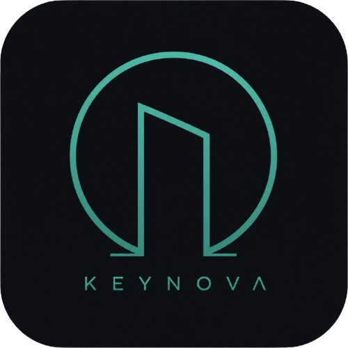
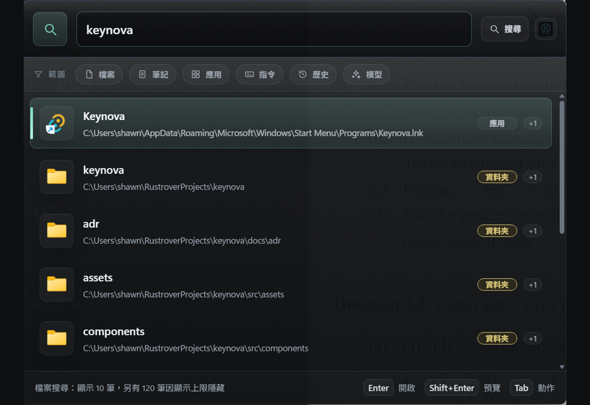
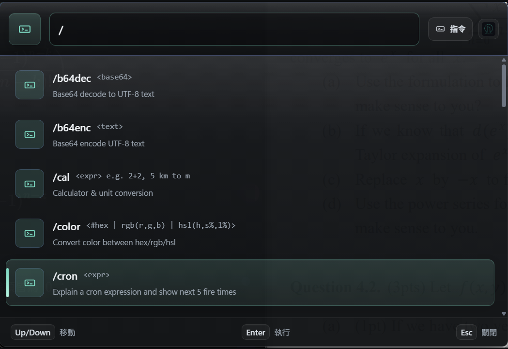
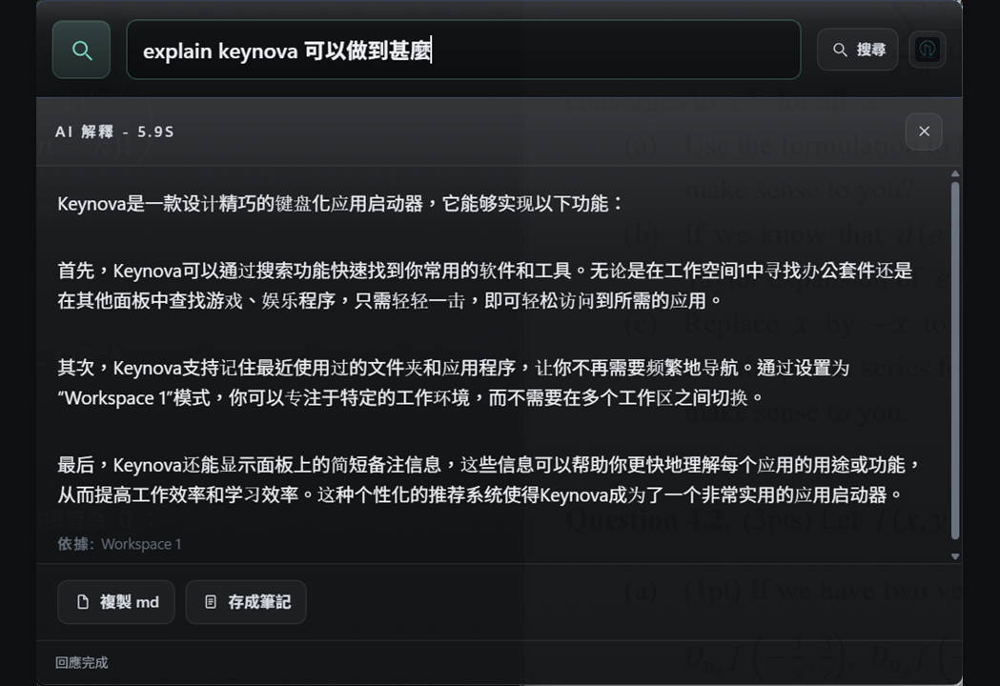
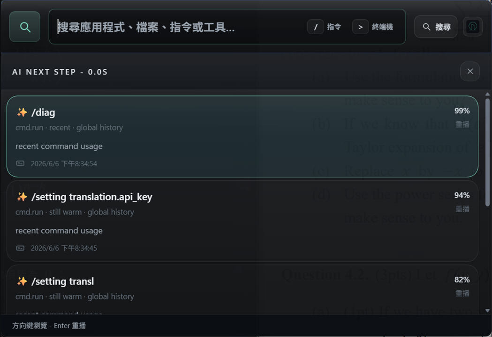
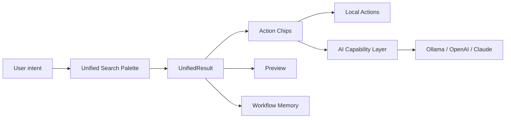

<div align="center">
  

  <h1>Keynova</h1>

  <p><strong>用一個搜尋框，完成整段開發工作流。</strong></p>

  <p>
    開應用程式、找檔案、查命令、執行工具，甚至用 AI 解決問題。<br>
    全部都在同一個鍵盤入口完成。
  </p>

  <p>
    <sub>如果你熟悉 Raycast 或 Alfred，Keynova 提供相似的鍵盤入口感，但更專注於開發者的本機工作流。</sub>
  </p>

  <p>
    <a href="https://github.com/aionyx02/keynova/releases"></a>
    
    <a href="LICENSE"></a>
  </p>

  <p>
    <a href="https://github.com/aionyx02/keynova/releases"><strong>下載最新版本</strong></a>
    &nbsp;·&nbsp;
    <a href="#快速開始"><strong>快速開始</strong></a>
    &nbsp;·&nbsp;
    <a href="docs/index.md"><strong>完整文件</strong></a>
    &nbsp;·&nbsp;
    <a href="docs/tasks/product-roadmap.md"><strong>Roadmap</strong></a>
  </p>
</div>

---

## 你可以用 Keynova 做什麼

- **一次搜尋所有內容**：同時尋找應用程式、檔案、資料夾、工作區、命令、歷史與筆記。
- **不離開鍵盤完成操作**：從搜尋、預覽、開啟，到重新命名、移動或下一步建議都留在同一個介面。
- **直接使用開發工具**：輸入 `/` 叫出計算、Base64、色碼、Cron、Hash、UUID、JWT 等常用工具。
- **需要時才使用 AI**：解釋錯誤、摘要文件、產生 shell command，或根據近期操作建議下一步。

<p align="center">
  <a href="docs/screenshots/overview.png"></a>
</p>

<p align="center">
  <sub>直接輸入即可搜尋；使用 <code>/</code> 進入命令，或用 <code>&gt;</code> 開啟終端機。</sub>
</p>

## 適合誰

- 需要頻繁切換應用程式、檔案、工作區與 terminal 的開發者。
- 偏好鍵盤操作，希望減少滑鼠與視窗切換的技術工作者。
- 想使用 AI 輔助工作，但不希望工作流被聊天介面取代的使用者。

## 介面一覽

<p align="center">
  <a href="docs/screenshots/unified-search.png"></a>
  <a href="docs/screenshots/developer-commands.png"></a>
</p>

<p align="center">
  <sub>左：<strong>統一搜尋</strong>　·　右：<strong>開發者命令</strong>（點擊圖片查看原尺寸）</sub>
</p>

<p align="center">
  <a href="docs/screenshots/inline-ai.png"></a>
  <a href="docs/screenshots/workflow-suggestions.png"></a>
</p>

<p align="center">
  <sub>左：<strong>Inline AI</strong>　·　右：<strong>下一步建議</strong>（點擊圖片查看原尺寸）</sub>
</p>

## 實際工作流

### 修一個開發錯誤

```text
1. 按下 Ctrl+K
2. 貼上錯誤訊息，或輸入 explain <錯誤訊息>
3. 閱讀原因與修復建議
4. 複製 AI 建議的 command
5. 輸入 > 開啟本機終端機
6. 確認內容後，由你親自執行
```

AI 命令卡只提供複製，不會自動執行，也不會在背景連續操作工具。

### 快速處理檔案

```text
1. 按下 Ctrl+K
2. 輸入檔名或工作區關鍵字
3. 按 Shift+Enter 預覽，或按 Enter 開啟
4. 按 Tab 查看次要操作
5. 選擇 rename、move、delete 或 copy path
6. 在破壞性操作前確認
```

### 不離開搜尋框使用開發工具

```text
Ctrl+K → /cal 5 km to m
Ctrl+K → /b64dec aGVsbG8=
Ctrl+K → /cron "0 */2 * * *"
Ctrl+K → /killport 3000
```

## 為什麼不是一般 Launcher

傳統 launcher 的工作通常在「打開東西」後結束。Keynova 把搜尋後的操作、預覽、工具與下一步也放進同一條鍵盤路徑。

| 一般 launcher                    | Keynova                                              |
| :------------------------------- | :--------------------------------------------------- |
| 主要用來開啟應用程式或文件       | 同時搜尋 app、檔案、命令、歷史、筆記與工作區         |
| 開啟結果後切換到其他工具繼續操作 | 在同一介面預覽、執行 action，或取得下一步建議        |
| 功能分散在不同面板               | 所有來源共享一致的結果、排序、preview 與 action 操作 |
| AI 通常是一個獨立聊天視窗        | AI 是單步 capability，只在目前工作流需要時出現       |
| 搜尋是入口                       | 搜尋是完整 workflow 的 dispatcher                    |

Keynova 不追求 Raycast 或 Alfred 的全功能廣度。它把產品範圍收斂在技術工作者每天反覆使用的本機工作流。

## 快速開始

### 1. 開啟 Keynova

按下 `Ctrl+K`。快捷鍵可在 `/setting` 的 hotkeys 區段調整。

### 2. 選擇輸入方式

| 輸入              | 模式               | 範例                                     |
| :---------------- | :----------------- | :--------------------------------------- |
| 一般文字          | 統一搜尋           | `README`、`keynova`、`settings`          |
| `/`               | 內建命令           | `/help`、`/setting`、`/cal 5 km to m`    |
| `>`               | 開啟本機終端機     | `>`                                      |
| capability 關鍵字 | Inline AI / memory | `explain ...`、`cmd ...`、`remember ...` |

### 3. 用鍵盤完成動作

| 按鍵          | 行為                                |
| :------------ | :---------------------------------- |
| `Up` / `Down` | 瀏覽結果或建議                      |
| `Enter`       | 開啟結果、執行命令或送出 capability |
| `Shift+Enter` | 預覽目前結果                        |
| `Tab`         | 開啟 secondary action menu          |
| `Esc`         | 返回上一層、關閉面板或隱藏 launcher |
| `?`           | 顯示鍵盤 cheatsheet                 |

## 核心工作流

### 統一搜尋與排序

- 工作區感知搜尋 app、檔案、資料夾、筆記、歷史、命令與模型。
- 搜尋 provider 採串流回傳，不必等待所有來源完成才看到第一筆結果。
- 所有來源轉成共用 `UnifiedResult`，統一處理 preview、rank signal 與 action chip。
- 可依檔案、筆記、應用程式、命令、歷史與模型篩選。
- Workflow Memory 記錄近期操作、context hash、suggestion ranking 與可重播的 replay descriptor。

### 檔案操作與預覽

支援的結果可執行：

- open
- reveal in Explorer / Finder / file manager
- preview
- copy path / copy name
- rename
- move
- delete
- metadata inspection
- SHA-256 計算

文字、圖片與檔案 metadata 可直接在 preview pane 檢視。重新命名、移動與刪除走明確的 confirmation flow；刪除完成後還會驗證檔案是否真的離開原路徑，避免 UI 顯示成功但磁碟狀態未改變。

### 終端機與開發工具

輸入 `>` 開啟預設 shell 的內嵌終端機。Terminal runtime 採 lazy mount，並使用後端核發的 launch spec；人類輸入與 AI 命令建議是兩條不同路徑。

內建工具包含計算、格式轉換與常用開發操作，例如：

```text
/cal 2+2
/cal 5 km to m
/b64enc hello
/b64dec aGVsbG8=
/color #7dd8c1
/cron "0 */2 * * *"
/uuid
/hash
/regex
/jwt
/killport 3000
```

實際可用命令、參數與補全以 launcher 內的 `/help` 和即時提示為準。

### 筆記、翻譯與模型

- **Notes**：內建 Markdown 筆記、工作區脈絡與另存 AI 回答。
- **Translation**：Google Cloud Translation v2 文字翻譯。
- **Model Manager**：透過 `/model` 下載、列出、啟用與移除本機模型，並依硬體顯示建議清單。
- **History**：本機 clipboard history、搜尋、釘選與貼上。
- **System / Learning / Nvim**：保留為選用或 feature-gated surface，不構成產品主敘事。

## AI 的角色

Keynova 不會變成聊天工具。AI 只在需要時出現，用來：

- 解釋程式碼與錯誤訊息。
- 摘要文件或長篇內容。
- 產生 shell command 與使用前提。
- 協助整理本機記憶。
- 根據近期工作建議下一步。

AI capability 完全採 search-first 介面，沒有獨立 chat 視窗：

```text
explain <程式碼、錯誤訊息或問題>
summarize <長文>
fix <錯誤訊息>
cmd <用自然語言描述要產生的命令>
remember <值得保存的資訊>
recall <要找回的資訊>
next
```

### 行為

- capability 是**單步、stateless**：回答串流到 result area，不保留 chat session，也不自主連續執行工具。
- 回答可複製為 Markdown，或存進本機筆記。
- 空白 palette 可直接載入 `next` 工作流建議。
- 一般搜尋查無結果時，自然語言 intent 可被判斷為 `explain`、`summarize`、`fix` 或 `cmd`，不一定要輸入前綴。
- `fix` 回傳修復說明與可選命令卡。
- `cmd` 顯示命令、風險、理由，以及生成時假設的 cwd、shell 與 OS。
- 使用本機脈絡時，回答卡以精簡的 `Based on` 標籤說明依據；片段、分數與 secret-classified 來源不會回傳到 UI。
- `next` 過濾重複、過期與無效目標，只有使用者明確選擇後才會使用 replay descriptor。

### 命令安全邊界

AI 產生的命令一律 **copy-only**：

- 只有 Copy，沒有 Edit、Run 或直接送進終端機的入口。
- 風險標籤只供檢視，不是執行閘門。
- AI capability 本身不提供任何命令執行路徑。
- 一般檔案刪除、重新命名與移動仍使用獨立的 UI confirmation flow。

### 模型建議

Inline AI 的延遲主要取決於硬體與 token 生成吞吐：

- `qwen2.5:1.5b`：預設建議，適合純 CPU 或低階機器，速度與品質較平衡。
- `qwen2.5:7b`：適合有 GPU 或優先追求回答品質的環境。

舊版 chat-first `AiPanel` 已移除。後端 typed-tool + approval agent runtime 以休眠形式保留；`ai.legacy_agent` 沒有 UI 入口，只供未來 tool-using capability 重新接用。

## 下載與安裝

預先編譯版本可直接從 **[GitHub Releases 下載](https://github.com/aionyx02/keynova/releases)**。

支援 Windows、macOS 與 Linux：

| 平台    | 發佈檔案                                    | 安裝方式                                             |
| :------ | :------------------------------------------ | :--------------------------------------------------- |
| Windows | `Keynova_<version>_x64-setup.exe`（NSIS）   | 雙擊執行；卸載使用「設定 → 應用程式」                |
| macOS   | `Keynova_<version>_universal.dmg`           | 開啟 `.dmg` 後拖入「應用程式」                       |
| Linux   | `keynova_<version>_amd64.deb` / `.AppImage` | `sudo apt install ./*.deb`，或賦予 AppImage 執行權限 |

### 第一次執行

目前 release 尚未完成正式 code signing / notarization：

- **Windows**：SmartScreen 可能顯示無法辨識，選擇「其他資訊 → 仍要執行」。
- **macOS**：在「系統設定 → 隱私權與安全性」允許一次，或執行：

  ```bash
  xattr -d com.apple.quarantine /Applications/Keynova.app
  ```

- **Linux**：AppImage 需先執行 `chmod +x Keynova*.AppImage`；deb 安裝後預設加入 PATH。

Code-signing 與 updater 管線已規劃為 secret-gated 流程；在正式 key 與憑證配置完成前，更新仍以手動下載 release 為主。

## 功能地圖

| 模組              | 能力                                                              |
| :---------------- | :---------------------------------------------------------------- |
| Command Palette   | 全域快捷鍵、模糊搜尋、結果瀏覽、鍵盤操作                          |
| Workspace Search  | 工作區感知搜尋、app / file provider、串流回傳                     |
| Unified Result    | 共用 result、preview、rank signal、action chip schema             |
| File Actions      | open、reveal、preview、rename、move、delete、真實刪除驗證         |
| Secondary Actions | 二級操作、inline input、confirmation flow                         |
| Preview Pane      | 文字、圖片與檔案 metadata 預覽                                    |
| Terminal          | 內嵌終端機、lazy runtime、後端 launch spec                        |
| Dev Utilities     | calculator、base64、color、cron、hash、uuid、regex、jwt、killport |
| Notes             | Markdown 筆記與工作區脈絡                                         |
| Translation       | Google Cloud Translation v2                                       |
| Model Manager     | 本機模型下載、列出、啟用與移除                                    |
| AI Capability     | explain、summarize、fix、cmd、remember、recall、next              |
| Workflow Memory   | 近期操作、context hash、suggestion ranking、replay descriptor     |
| Onboarding        | 首次使用引導、空狀態 CTA、cheatsheet                              |

## 產品定位與邊界

> **Keyboard-first local workflow entry for technical workers.**

Keynova 不是通用 launcher、AI chat app 或 catch-all 生產力套件。產品主線只聚焦在技術工作者每天會反覆使用的本機工作流。

### 核心與選用功能

- **核心 daily path**：unified search、file actions、terminal、project command discovery、dev utilities、inline AI capability。
- **選用 / parked**：Model Manager、Translation、Notes、Automation、Nvim、Learning Panel、System Monitor、Plugin System、長期自主 agent memory。這些功能可存在於 feature gate 後，但不主導 v0.6 / v0.7 的產品敘事。

### 明確非目標

- 不追求 Alfred / Raycast 的全功能廣度。
- 不建立 chat-first AI 中心。
- 不把 autonomous agent 當產品 mainline。
- 不擴張成與核心工作流無關的通用 productivity suite。

完整 core-vs-parked 分界與 v0.6 到 v1.0 的計畫見 [Product Roadmap](docs/tasks/product-roadmap.md)。

## 設定

設定檔位於平台 config 目錄：

| 平台    | 路徑                                                |
| :------ | :-------------------------------------------------- |
| Windows | `%APPDATA%\Keynova\config.toml`                     |
| Linux   | `~/.config/keynova/config.toml`                     |
| macOS   | `~/Library/Application Support/Keynova/config.toml` |

常見設定：

```toml
[ai]
provider = "ollama"
model = "qwen2.5:1.5b"
ollama_url = "http://localhost:11434"

[translation]
provider = "google_cloud_v2"
default_dst = "zh-TW"
api_key = ""

[search]
backend = "auto"

[performance]
low_memory_mode = false
```

- `performance.low_memory_mode = true` 會跳過 terminal prewarm、避免啟動時重新索引，並縮短 Ollama keep-alive。
- API key 等機密設定在 `setting.list_all` 回傳前會於本機端遮罩，避免明文進入 UI。
- Windows 搜尋可使用 Everything；跨平台環境則使用 Tantivy 與平台 fallback。

## 架構與設計原則


```mermaid
flowchart LR
    Intent["User intent"] --> Palette["Unified Search Palette"]
    Palette --> Result["UnifiedResult"]
    Result --> Actions["Action Chips"]
    Result --> Preview["Preview"]
    Result --> Memory["Workflow Memory"]
    Actions --> Local["Local Actions"]
    Actions --> Capability["AI Capability Layer"]
    Capability --> Provider["Ollama / OpenAI / Claude"]
```

- **Search-first**：搜尋框是 dispatcher，不是聊天視窗入口。
- **Local-first**：預設偏向本機能力，外部 AI、翻譯與網路服務明確 opt-in。
- **Typed boundary**：IPC、action 與 AI capability 使用 typed contract。
- **Approval-aware**：高風險操作必須可見、可確認、可取消。
- **Bounded runtime**：搜尋、預覽、prompt、工具輸出與背景服務都有大小或時間上限。

重要架構、安全與 IPC contract 變更先建立 ADR，索引見 [docs/decisions.md](docs/decisions.md)。

## 安全模型

- 不提供 generic shell execution。
- AI 命令卡沒有執行能力。
- Destructive file action 需要明確確認與結果驗證。
- 網路請求受 allowlist / policy boundary 控制。
- Keynova-owned data 目錄與可讀寫範圍有明確界線。
- Secret-classified context 不會回傳到一般 UI。
- 外部 provider 與個人 memory grounding 依 policy 與 feature flag 決定是否啟用。

完整 permission、path、network、secret 與 release trust 模型見 [docs/security.md](docs/security.md)。

## 平台與效能

### 平台支援

| 平台                | 狀態                                   | 備註                                                    |
| :------------------ | :------------------------------------- | :------------------------------------------------------ |
| Windows 10+         | 主要開發平台                           | Everything、WebView2 與完整日常工作流                   |
| Linux X11 / Wayland | 支援，建置已於 v0.4.0 修復             | 跨平台搜尋與系統 fallback；部分 OS integration 持續補齊 |
| macOS 11+           | 支援，universal build 已於 v0.4.0 修復 | 部分 OS integration 持續補齊                            |

### Windows 記憶體足跡

Keynova 的真實常駐足跡以 **Private Working Set** 計算約為 **80 MB**：

- `tauri-app.exe` host：約 8 MB
- Keynova 擁有的 WebView2 子行程：約 71 MB

工作管理員或資源監視器可能將整棵行程樹顯示為約 324 MB，其中約 243 MB 是 Edge / Chromium runtime 的共享 DLL 頁。OS 只保存一份，卻可能在每個 WebView2 行程的工作集重複顯示，不代表 Keynova 獨占同等記憶體。

降載手段包括：

- release profile 的 strip + thin-LTO
- 視窗隱藏時呼叫 host `EmptyWorkingSet`
- WebView2 `SetMemoryUsageTargetLevel(Low)`
- `--disable-gpu`
- `performance.low_memory_mode`

## 從原始碼建置

### 環境需求

- Node.js 18+
- Rust stable
- Windows：MSVC Build Tools、WebView2 Runtime
- Linux：Tauri 2 所需 GTK / WebKit 套件，例如 `libwebkit2gtk-4.1-dev`、`libayatana-appindicator3-dev`、`librsvg2-dev`
- macOS：Xcode Command Line Tools

### 開發與打包

```bash
npm install
npm run tauri dev
npm run tauri build
```

`npm run tauri build` 的產物位於 `src-tauri/target/release/bundle/`，依平台包含 NSIS、MSI、DMG、DEB 或 AppImage。

`.github/workflows/release.yml` 定義跨平台 release 流程。Push `v*` tag 後會執行 Windows、macOS universal 與 Linux build，並建立 draft release。

### 開發指令

```bash
npm run dev              # Vite frontend
npm run build            # TypeScript check + frontend build
npm run lint             # ESLint
npm run test             # Vitest
npm run rust:test        # Rust tests
npm run rust:clippy      # Rust clippy，warnings 視為錯誤
npm run docs:refresh     # 文件同步與 guard
npm run verify           # 文件、前端與 Rust 完整驗證
```

## Roadmap

目前優先順序是把 workflow dispatcher 的日常路徑做深、做穩，再擴大產品範圍。

| 項目                        | 方向                                                          |
| :-------------------------- | :------------------------------------------------------------ |
| Code signing / notarization | Windows Authenticode、macOS Developer ID 與正式 release trust |
| In-app updater              | 透過 GitHub Releases 更新；在 signing key 完成前保持 dormant  |
| Secret at-rest storage      | 將 API key 等機密從 config 遷移到 OS keychain                 |
| Workflow ranking            | 納入 recency、frequency、success rate 與更完整 context        |
| Cross-platform polish       | Windows-first 穩定後，持續補齊 macOS / Linux integration      |

更完整的 batch、acceptance criteria、KPI 與 parked scope 見 [docs/tasks/product-roadmap.md](docs/tasks/product-roadmap.md)。

## 文件導覽

| 文件                                                           | 用途                                   |
| :------------------------------------------------------------- | :------------------------------------- |
| [docs/index.md](docs/index.md)                                 | 文件入口與路由                         |
| [docs/memory/current.md](docs/memory/current.md)               | 當前策略、限制與記憶                   |
| [docs/tasks/active.md](docs/tasks/active.md)                   | Active queue                           |
| [docs/tasks/product-roadmap.md](docs/tasks/product-roadmap.md) | 產品定位、core / parked 與版本路線     |
| [docs/architecture.md](docs/architecture.md)                   | 系統架構與模組參考                     |
| [docs/security.md](docs/security.md)                           | Permission、network、secret 與安全邊界 |
| [docs/decisions.md](docs/decisions.md)                         | ADR 索引                               |
| [docs/license-compliance.md](docs/license-compliance.md)       | 第三方授權與合規                       |

## 貢獻

送出變更前請執行：

```bash
npm run verify
```

開發原則：

- 不新增 generic shell execution。
- 不把 AI 放回產品中心。
- 不繞過 approval / confirmation boundary。
- 不讓單一 component 或 handler 成為 god module。
- 重要架構、安全與 IPC contract 變更必須先建立或更新 ADR。
- README、security docs、release notes 與實作必須同步。

## License

[AGPL-3.0-or-later](LICENSE)。第三方相依與合規細節見 [docs/license-compliance.md](docs/license-compliance.md)。
